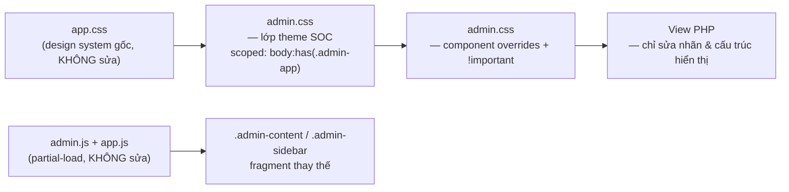

# ADMIN UI REDESIGN PLAN — vc-vpn-2027

> **Phong cách:** Cybersecurity Command Center (SOC / Tactical HUD)
> **Tone:** Dark Cyber — nền tối sâu, tương phản cao, accent neon Cyan / Green / Red, dữ liệu kỹ thuật (IP, log, token, ID) dùng font Monospace.
> **Ràng buộc vàng:**
> 1. **KHÔNG** sửa business logic / backend / core function. Chỉ can thiệp lớp hiển thị: HTML markup (nội dung nhãn, cấu trúc bọc), CSS/SCSS, UI JS thuần.
> 2. **GIỮ NGUYÊN** toàn bộ `id`, class hook, API call, `data-*`, event handler, tên biến PHP, route, form `name`/`value`.
> 3. **KHÔNG** flicker / layout shift: chỉ transition `transform`, `opacity`, `color`, `background-color`, `border-color`; giữ `scrollbar-gutter: stable`; không animate `height/width/top/left`.
> 4. Nhãn nút **cực ngắn**, phong cách SOC/Tactical: `Lưu`, `Lọc`, `Bật`, `Tắt`, `Sync`, `Purge`, `Apply`, `Export`, `Thêm`, `Sửa`, `Xóa`…

---

## Kiến trúc tiếp cận (áp dụng xuyên suốt)

- `admin.css` được nạp **sau** `app.css` (xem `layouts/header.php`) → ghi đè an toàn.
- **`body:has(.admin-app)`** làm scope: chỉ trang Admin đổi theme, trang Home/User/Auth giữ nguyên.
- **Áp dụng biến CSS** (`--ios-*`, `--glass-*`) → gần hết style inline trong view (`color: var(--ios-danger)`, `background: var(--glass-bg)`…) tự động chuyển theo bảng màu SOC mà **không phải sửa 1.967 attribute `style=`**.
- Chống giật màn hình: kế thừa nguyên hệ partial-load sẵn có của `admin.js` (thay fragment, fade `opacity`, progress bar 2px) — **không đụng vào JS**.

---

## Bảng màu SOC (Design Tokens)

| Token | Giá trị | Vai trò |
|---|---|---|
| `--soc-bg-0` | `#05070d` | Nền tối sâu (space) |
| `--soc-bg-1` | `#0a0f1a` | Nền panel |
| `--soc-cyan` | `#22d3ee` | Accent chính / active / link |
| `--soc-green` | `#2ee6a6` | Thành công / online |
| `--soc-red` | `#ff4d6d` | Nguy hiểm / offline / purge |
| `--soc-amber` | `#ffb020` | Cảnh báo |
| `--soc-line` | `rgba(34,211,238,.16)` | Viền HUD |
| `--soc-mono` | `ui-monospace, Consolas, monospace` | Font kỹ thuật |

---

## PHASES

### Phase 0 — Khảo sát mã nguồn hiện tại
- [x] Liệt kê cấu trúc `resources/views/admin/*` (60 file), `layouts/admin.php`, `admin-sidebar.php`, `navbar.php`, `header.php`, `footer.php`
- [x] Đọc `public/assets/css/app.css` (design token, shell, component) + `public/assets/css/admin.css` (992 dòng)
- [x] Đọc `public/assets/js/admin.js` — chốt danh sách **hook phải giữ**: `.admin-content`, `.admin-sidebar`, `.action-btn`, `.action-menu`, `.glass-alert`, `.alert-close`, `.settings-tab-btn/-pane`, `.vc-partial-progress`, `.admin-content.vc-fading`, `window.vcPageInits`, `#page-preloader`
- [x] Thống kê inline style (1.967 `style=` trên 61 file) → chọn hướng remap biến CSS thay vì sửa hàng loạt
- [x] Thu thập toàn bộ nhãn nút/link đang dùng để rút gọn

### Phase 1 — Nền tảng Design System SOC (`admin.css`)
- [x] Bảng biến CSS dark cyber scoped `body:has(.admin-app)` + `.admin-app` (**Phase 12**: nâng thành `body.admin-area:has(.admin-app)` để tách Admin/User)
- [x] Nền tactical grid + vignette (static, không animate → 0 cost)
- [x] Ghi đè `body.user-festival` (ánh sáng ban ngày) chỉ trong scope Admin
- [x] Font monospace cho dữ liệu kỹ thuật (`.mono`, IP, token, log, số liệu)
- [x] Quy tắc transition an toàn 60fps + chống layout shift (`scrollbar-gutter`, `min-height` nút)

### Phase 2 — Shell: Sidebar / Topbar / Vùng cuộn
- [x] Sidebar: panel kính tối, nav-item kiểu HUD (thanh accent trái khi `active`), section-title mono
- [x] Brand + icon sidebar (thay emoji bằng mã mono `DSH/CFG/INF/USR/BIZ/TKT/AI/PST/CST/LOG`)
- [x] Group tabs + group header (`.admin-group-tabs`, `.admin-group-header`)
- [x] Navbar Admin: topbar tactical (toggle, notification, profile dropdown) — dark
- [x] Overlay, preloader, progress bar, footer công khai → tối gọn (không ẩn để tránh shift)
- [x] Responsive mobile (sidebar slide, nút ☰)

### Phase 3 — Bộ component HUD
- [x] `.glass-card` → HUD panel (viền neon + corner bracket)
- [x] `.stats-grid` / `.stat-card` → KPI module
- [x] `.glass-table` + `.table-responsive` → bảng điều khiển (header mono, zebra, row hover)
- [x] `.action-btn` / `.action-menu` / `.action-item` → menu tactical
- [x] `.glass-btn` (primary / ghost / danger), `.btn-icon`
- [x] `.glass-input` / select / textarea / focus ring cyan
- [x] Badge (`.badge-status`, `.badge-code`, `.logs-*`) → chip neon có dot
- [x] Tabs: `.settings-tab-btn`, `.logs-tab`
- [x] `.u-pagination`, modal (`.glass-modal-overlay`), toast (`.vc-toast`), alert (`.glass-alert`)
- [x] `.empty-state` / `.logs-empty`

### Phase 4 — Dashboard Admin (`admin/dashboard.php`)
- [x] Bố cục lại: KPI HUD row → bảng tác chiến 2 cột
- [x] Rút gọn nhãn nút

### Phase 5 — Hạ tầng VPN
- [x] `server-groups/index|create|edit`
- [x] `servers/index|create|edit|detail`
- [x] `nodes/index|detail`
- [x] `plans/index|create|edit`

### Phase 6 — Người dùng & Kinh doanh
- [x] `users/index|create|edit|detail`
- [x] `coupons/index|create|edit`
- [x] `orders/index|create|detail`
- [x] `payments/index|detail`
- [x] `subscriptions/index|detail`
- [x] `referrals/index`, `withdrawals/index|detail`

### Phase 7 — Vận hành
- [x] `tickets/index|detail`
- [x] `posts/index|create|edit|detail`
- [x] `expenses/index|create|edit`
- [x] `notifications/index`

### Phase 8 — Nhật ký & Cài đặt
- [x] `logs/index|access|email|system|macrodroid`
- [x] `settings/index`

### Phase 9 — Trung tâm AI (14 view)
- [x] `ai/dashboard.php`, `_tab-header`, `_flash`, `_media-gallery`
- [x] `ai/tab-image|tab-video|tab-dubbing|tab-fanpage|tab-reply`
- [x] `ai/settings`, `ai/prompt-edit`, `ai/task-detail`, `ai/conversations`, `ai/conversation-detail`, `ai/output-detail`, `ai/assistant`

### Phase 10 — Sweep nhãn nút toàn cục (SOC wording)
- [x] Rút gọn mọi nút còn lại về từ đơn/2 từ: `Lưu`, `Lọc`, `Thêm`, `Sửa`, `Xóa`, `Sync`, `Purge`, `Apply`, `Export`, `Tìm`, `Đóng`, `Xem`, `Chạy`… (3 đợt sweep: 80 + 37 + 60 = 177 thay thế; kiểm tra: 0 nhãn > 14 ký tự)
- [x] Kiểm tra không thay đổi `value`/`name`/`data-*` của mọi nút gửi form (hook-token diff vs HEAD: 63 file, 0 token mất; 2 giá trị màu inline trong `onmouseover/onmouseout` đổi có chủ đích)
- [x] Sweep emoji → mã mono SOC toàn admin (2 đợt, exact-literal + line-anchor): `USR/AI/CFG/✓/✕/◷/▲/»/⟳/▷…`; group-tab icon → `GRP/SRV/NOD/PLN/CPN/ORD/PAY/SUB/REF/WDR/OVW/IMG/VID/DUB/FPG/RPL/CFG`; sót lại 6 dòng cố ý (2 `data-copy-label` không hiển thị + 4 comment)

### Phase 11 — Kiểm chứng (Definition of Done)
- [x] `php -l` toàn bộ view đã sửa → không lỗi cú pháp (**123/123 view PASS**)
- [x] Không còn tham chiếu hook bị đổi tên (grep `.action-btn`, `.admin-content`, `.settings-tab-btn`, `vcPageInits`) — diff token `id/class/data-*/onclick/name` vs HEAD: 0 hook mất; `public/assets/js/*` + `app.css` không đổi (git status trống)
- [x] Không flicker: mọi transition chỉ dùng `transform/opacity/color/background-color/border-color` (audit 0 transition animate `width/height/top/left`; keyframes mới chỉ `opacity`)
- [x] Không layout shift: nút/badge có `min-height`, cuộn giữ `scrollbar-gutter: stable` (`admin.css:1259`)
- [x] Trang Home/User/Auth **không** bị ảnh hưởng — *ghi nhận giai đoạn này: scope `body:has(.admin-app)` chưa đủ chặt vì `layouts/app.php` cũng dùng wrapper `.admin-app` → phát hiện rò rỉ và xử lý dứt điểm ở **Phase 12***; không thêm `:root` mới trong `admin.css`
- [x] UTF-8 nghiêm ngặt toàn bộ 123 view → 0 lỗi decode / 0 `U+FFFD`
- [x] `admin.css` cân bằng ngoặc nhọn (depth = 0)

### Phase 12 — Tách bạch Admin / User (chống rò rỉ theme SOC)
- [x] **Chẩn nguyên nhân**: `layouts/app.php:93` (toàn bộ trang Home/User/Policies) cũng bọc `
` và `app.php:2` mặc định `$extraCss='admin'` → selector `body:has(.admin-app)` (174 chỗ) match cả trang user → theme SOC rò sang khu user. 54 view đã sửa đều nằm dưới `views/admin/` — không view user nào bị đụng code
- [x] **Positive marker**: `layouts/admin.php` set `$vcAdminShell = true`; `layouts/header.php` render body class `admin-area` (chỉ trang Admin; markup thuần, không đổi logic/handler). Render test CLI: có flag → `<body class="vpn-theme user-festival admin-area">`, không flag → không có class
- [x] **Nâng scope**: `body:has(.admin-app)` → `body.admin-area:has(.admin-app)` toàn bộ **174 occurrence / 172 dòng** trong `admin.css` (dòng 993+; 992 dòng gốc nguyên vẹn); cập nhật comment scope đầu file
- [x] **Audit**: 139/139 selector trong vùng bổ sung đều scoped đúng, brace balance = 0, 0 selector cũ sót (`body:has(` = 0); `php -l` 2 layout PASS
- [x] **Live test**: HTTP `/` → `home-festival`, `/user/guides` → không `admin-area` (0 trang public có marker)
- [x] **An toàn partial-nav** (không đụng JS): `admin.js` chỉ chặn link/form `/admin` (dòng 335/386/562), `app.js` loại `/admin` khỏi partial (dòng ~178) → trang Admin luôn full-render khi vào/ra; fragment admin không trả `body_classes` → `admin-area` giữ nguyên; `app.js` chỉ toggle `home-festival`/`user-area` → không bao giờ tự thêm `admin-area`

### Phase 13 — Bugfix: menu Profile navbar Admin đẩy navbar xuống
- [x] **Chẩn nguyên nhân**: profile dropdown dùng `class="profile-menu glass-card"` (navbar.php:70); rule HUD `§7 .glass-card { position: relative }` (admin.css:1318, ưu tiên 0-3-1) áp đè `.profile-menu { position: absolute }` của app.css (0-1-0) → dropdown rơi vào normal flow, mở ra là đẩy navbar 64px xuống dưới
- [x] **Sửa (CSS display thuần, không đụng markup/JS)**: rule bù `body.admin-area:has(.admin-app) .profile-menu.glass-card` (+ `.guest-mobile-menu.glass-card` phòng cháy) = ưu tiên 0-4-1 thắng §7 bất kể thứ tự; `position: absolute; z-index: 110` + wrapper `z-index: 110` (nâng 1 lớp từ 101/105 theo yêu cầu)
- [x] **Kiểm chứng**: brace balance = 0, `§7 .glass-card` nguyên vẹn; trang test thực tế mở menu → navbar giữ **64px** (không đẩy), `position: absolute`, `z-index: 110`, menu overlay nổi trên nội dung (screenshot PASS); trang public không có `admin-area` → rule inert

### Phase 14 — Bố cục card Khoá API (`admin/ai/settings.php`)
- [x] Gộp 2 form Save/Test vào 1 hàng ngang: wrapper `display:flex; align-items:flex-end; gap:0.5rem`, form Save `flex:1; min-width:0`, hàng nút Save `justify-content:flex-end` (đúng pattern card Chatbot cùng trang), form Test `margin:0` — **chỉ đổi markup/CSS hiển thị**, 2 `action` POST, `name`/`csrf_token`/`required` giữ nguyên
- [x] Kiểm chứng: `php -l` PASS; trang test thực tế đo rect: Lưu & Test cùng top/bottom (160/194), gap 8px, input không chồng cột Test (screenshot PASS)

### Phase 15 — Footer Admin sát đáy
- [x] Nguyên nhân: `.admin-main` (SOC, Phase 1) đổi `padding-bottom` 1rem → **2.5rem** nhưng `.vc-footer` (base app.css) chỉ `margin-bottom: -1rem` → footer "treo" **24px** phía trên đáy vùng cuộn
- [x] Fix: thêm `margin-bottom: -2.5rem` vào rule FOOTER (§21) của admin.css — bù đủ padding đáy, footer dính sát đáy; chỉ CSS hiển thị, không đụng markup/handler
- [x] Kiểm chứng: trang test đo rect — `gapBelowFooter` 24px → **0px** (footerBottom = viewportH = 547), SOC border-top giữ nguyên, brace balance 0/0 (screenshot PASS)

### Phase 16 — Dashboard User: thống kê full-width khi không có thông báo
- [x] Nguyên nhân: `.dashboard-overview` grid 2 cột (thông báo cột 1, thống kê cột 2) — `$noticePosts` rỗng → `.dashboard-notices` không render nhưng thống kê vẫn bị ghim `grid-column: 2` → bỏ trống nửa trái
- [x] Fix (pure CSS, không sửa markup/PHP logic): thêm vào `<style>` inline của `user/dashboard.php` — `@media (min-width: 901px) { .dashboard-overview:not(:has(.dashboard-notices)) .dashboard-statistics { grid-column: 1 / -1 } + .dashboard-grid-4 { repeat(4) } }` — 4 thẻ về 1 hàng như base `app.css`, ≤900px giữ responsive cũ (2 cột → 768 `!important` → 560 1 cột)
- [x] Kiểm chứng: `php -l` PASS; trang test 1440px — **Có thông báo**: thống kê 710px bên phải, grid 2 cột (giữ nguyên); **Không thông báo**: thống kê **1440px full-width**, grid **4 cột** (screenshot PASS)

### Phase 17 — Trang Gói: bỏ bắt chữ sinh icon, icon theo admin gõ đầu dòng
- [x] Yêu cầu: bỏ logic "tự bắt chữ" (chuỗi ~15 nhánh `strpos` từ khóa trên label mô tả) trong `user/plans/index.php` — icon hiển thị theo nội dung admin tự gõ đầu dòng khi thêm/sửa gói (VD: `⚡ Tốc độ: 1000 Mbps`); thuần lớp hiển thị, không sửa DB/controller/backend (đã chốt với user: admin tự gõ icon, không thêm field mới)
- [x] Fix: thay khối bắt chữ bằng `preg_match('/^([^\p{L}\p{N}]+)\s*/u', ...)` — tách token ký hiệu đầu dòng làm icon (render `` 16px class `u-fig-icon`, qua `htmlspecialchars`); admin không gõ icon → giữ icon Check mặc định; label/value tách từ phần còn lại của dòng — dòng không có icon giữ nguyên hành vi cũ; 39 dòng → 21 dòng
- [x] Kiểm chứng: `php -l` PASS; harness chạy đúng code path thật của view → 5 dòng test: ⚡/🛡️ lấy từ admin gõ (label sạch, không còn emoji lẫn vào chữ), 3 dòng không icon → Check SVG (không còn icon theo từ khóa: headset/speed/monitor...); geometry 16×16, offset 3px, gap 8px — không lệch layout (screenshot PASS)

### Phase 18 — Đồng bộ icon "admin gõ đầu dòng" cho Dashboard User & Trang chủ
- [x] Lý do: `user/dashboard.php` và `home/index.php` có **cùng block "bắt chữ sinh icon"** (chain ~15 nhánh `strpos`) như trang Gói đã gỡ ở Phase 17 → nếu để lại, emoji admin gõ sẽ bị lẫn vào chữ + 2 trang vẫn tự sinh icon từ từ khóa (mất nhất quán)
- [x] Fix (thuần hiển thị, cùng pattern Phase 17): thay 2 block bằng regex tách icon đầu dòng + fallback Check — `dashboard.php` 39→21 dòng (icon class `u-fig-icon` 16px), `home/index.php` 52→21 dòng (icon class `plan-emoji-icon` theo scope `home.css`)
- [x] `home.css`: thêm rule `.plan-emoji-icon` (base 18px + scope 16px đặt cạnh rule `li svg`) để emoji luôn cùng kích thước với svg fallback ở mọi viewport
- [x] Kiểm chứng: `php -l` PASS ×2; `strpos($lowerLabel)` = 0 ở cả 2 file; harness eval code-path thật → 5+5 dòng; browser đo parity tuyệt đối (home: emoji = svg = 16×16/offset 2px, dash: 16×16/offset 3px, gap 8px, flex-shrink 0 ở mọi dòng); screenshot PASS

### Phase 19 — Dashboard: block "$featureLines" (Bảng Giá Gói) dính icon Check cố định
- [x] Báo lỗi: mục "Bảng Giá Gói Dịch Vụ" trong Dashboard User — mọi dòng mô tả đều hiện icon Check mặc định, emoji admin gõ (⚡🛡️) bị đẩy vào chữ label
- [x] Nguyên nhân: block thứ 2 của `dashboard.php` dùng vòng lặp `$featureLines` (dòng ~763) với **`<svg>` Check hardcode sẵn trong `<li>`** — không qua cơ chế icon của Phase 18 (2 block info-list: `$lines` đã fix, `$featureLines` bị sót)
- [x] Fix (thuần hiển thị): thêm tách token icon đầu dòng (`preg_match` cùng pattern) vào header PHP của vòng lặp + render biến `$featureIconSvg` (emoji admin → span `u-fig-icon` 16px; không có → giữ nguyên SVG Check cũ); gán lại `$featureLine` sau khi tách — foreach by-value an toàn
- [x] Kiểm chứng: `php -l` PASS; harness eval đúng vòng lặp thật → 5 dòng: ⚡/🛡️ làm icon, label sạch (emoji không còn lẫn vào `<strong>`), 3 dòng không icon → Check; geometry 16×16 / offset 3px / gap 8px / flex-shrink 0 (allOk=true, screenshot PASS)

---

## Tiến độ
| Cập nhật | Trạng thái |
|---|---|
| 2026-10-06 | Khởi tạo kế hoạch — Phase 0 hoàn tất |
| 2026-10-06 | Phase 1–3 hoàn tất — `admin.css` 992 → 1792 dòng (theme SOC scoped `body:has(.admin-app)`), sidebar markup đã rút gọn nhãn + mã icon mono |
| 2026-10-06 | Phase 4–10 hoàn tất — 57 view sửa hiển thị; sweep nhãn SOC 177 + emoji→mono 2 đợt; sửa 3 file lỗi ký tự trong lúc sweep (khôi phục từ HEAD, `php -l` OK) |
| 2026-10-06 | Phase 11 hoàn tất — `php -l` 123/123, UTF-8 123/123, 0 hook mất, core JS/app.css nguyên vẹn, 0 layout-animating transition |
| 2026-10-06 | Phase 12 hoàn tất — tách Admin/User: body marker `admin-area` (admin.php → header.php) + nâng scope 174 selector trong `admin.css`; trang user không còn dính theme SOC (audit 139/139, live test PASS) |
| 2026-10-06 | Phase 13 hoàn tất — fix menu Profile Admin: `.glass-card{position:relative}` áp đè `.profile-menu{position:absolute}` → thêm rule bù 0-4-1 + z-index 110; navbar giữ 64px khi mở menu (test page PASS) |
| 2026-10-06 | Phase 14 hoàn tất — card Khoá API: 2 form Save/Test vào cùng hàng `[Lưu][Test]` (flex wrapper, không đổi action/handler); php -l PASS + test page PASS |
| 2026-10-06 | Phase 15 hoàn tất — Footer Admin sát đáy: bù `margin-bottom: -2.5rem` (padding SOC) → gap 24px→0; test page PASS (screenshot + rect đo) |
| 2026-10-06 | Phase 16 hoàn tất — Dashboard User: không có thông báo → 4 thẻ thống kê full-width 1 hàng (`:has()` pure CSS, `grid-column: 1/-1` + `repeat(4)`); php -l + test page 1440px PASS |
| 2026-10-06 | Phase 17 hoàn tất — Trang Gói: bỏ bắt chữ sinh icon (keyword chain `strpos` = 0, 39→21 dòng) → icon theo admin gõ đầu dòng (regex tách icon + fallback Check); php -l + harness code-path test 5 dòng PASS |
| 2026-10-06 | Phase 18 hoàn tất — Đồng bộ icon admin-gõ cho Dashboard User + Trang chủ: gỡ 2 block bắt chữ (39→21 & 52→21 dòng), thêm CSS `.plan-emoji-icon`; parity icon 16×16 hoàn hảo mọi viewport, screenshot PASS |
| 2026-10-06 | Phase 19 hoàn tất — Fix block `$featureLines` (Bảng Giá Gói) dính icon Check cố định: tách icon admin gõ đầu dòng + fallback Check; php -l + harness 5 dòng allOk=true, screenshot PASS | 
