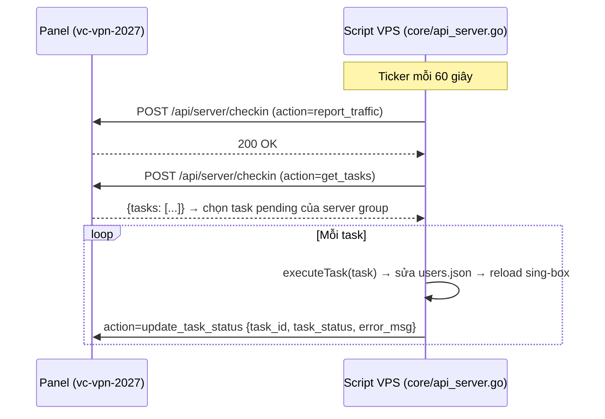

# HỢP ĐỒNG TASK — Panel (vc-vpn-2027) — Script VPS (menu-singbox-vvc)

> Tài liệu thỏa thuận giữa 2 phía. Mọi thay đổi luồng gửi/nhận task phải cập nhật tài liệu này trước.
> Áp dụng từ 2026-10-05 · Trạng thái: **vàng (đang triển khai)**

---

## 1. Tổng quan luồng



- **Hướng:** Panel sinh task vào bảng `vc_node_tasks` → script lấy bằng `get_tasks` → chạy → báo `update_task_status`.
- **Tần suất:** mỗi task về tay VPS muộn nhất **1 chu kỳ (≤60s)** vì `report_traffic` chạy trước `get_tasks` trong cùng tick.
- **Cắt/mở kết nối:** `build_and_apply_config` (modules/utils.sh) chỉ đưa user có `status ∈ {active, null, ""}` vào config sing-box.

---

## 2. Bốn action chuẩn (4 action, không dùng `toggle_user`)

| Action | Ý nghĩa | Payload (JSON) | Task thành công khi |
|---|---|---|---|
| `add_user` | Tạo **hoặc cập nhật** user | `{username, uuid, transfer_enable, end_date, status, max_devices?}` | user tồn tại trong `users.json` đúng uuid/limit/status |
| `delete_user` | Xóa vĩnh viễn | `{username, reason}` | user không còn trong `users.json` |
| `disable_user` | Tắt mạng (giữ nguyên quota/uuid) | `{username, reason, lock_seconds?, locked_until?}` | `status=disabled` + config sing-box đã reload |
| `enable_user` | Mở lại mạng | `{username, reason}` | `status=active` + config sing-box đã reload |

**Payload tối thiểu là `username`.** Field thiếu → script dùng mặc định an toàn, **không** được crash.

### 2.1 Quy tắc `status`
- Vocabulary phía script (users.json): **chỉ `active` hoặc `disabled`** (`null`/`""` coi như `active` → tương thích file cũ).
- Vocabulary `vc_subscriptions.status`: `active|expired|suspended|cancelled` → **không** truyền thẳng vào payload; luôn ánh xạ sang `reason` (bảng 2.2) rồi script set `disabled`.
- Payload `add_user` **phải** mang `status` tường minh (`active` | `disabled`).
  - Nếu user đã tồn tại và payload **không** có `status` → **giữ nguyên** status hiện tại (không được âm thầm bật lại user đang khóa).

### 2.2 Bảng `reason` chuẩn hóa

**Bên disable (`disable_user`):**

| `reason` | Nguồn |
|---|---|
| `expired` | hết hạn (`end_date`), cron |
| `data_exceeded` | vượt dung lượng, realtime |
| `admin` | admin tắt tay |
| `cancelled` | đơn bị hủy |
| `device_limit` | **khóa 1 phút vì vượt số thiết bị cho phép** |

**Bên enable (`enable_user`) / mở lại:**

| `reason` | Nguồn |
|---|---|
| `monthly_reset` | cron reset đầu tháng |
| `renewed` | gia hạn / thanh toán thành công |
| `lock_expired` | **timer 60s của script tự mở lại** |
| `admin` | admin bật tay |

`reason` không thuộc bảng → ghi log, vẫn xử lý action, không fail task.

### 2.3 Lý do bỏ `toggle_user`
- Không phân biệt được "tắt thật" vs "đang khóa tạm" vs "bật lại".
- Trạng thái gửi verbatim → `inactive`/`disabled` lệch nhau giữa các nơi của panel.
- Script cũ nhận action lạ sẽ **báo `done` giả** (bug) → fail im lặng.
- Trong giai đoạn chuyển tiếp, script vẫn giữ `toggle_user` như **alias deprecated** (map `active`→`enable_user`, còn lại→`disable_user`, reason=`admin`) → gỡ sau khi panel lên phiên bản mới hoàn tất.

---

## 3. Cơ chế khóa mạng 1 phút (device_limit)

### 3.1 Điều kiện kích hoạt (Panel → `Subscription::enforceDeviceLimit`)
Gọi sau mỗi lần cập nhật `online_devices` từ `report_traffic`:

```
NẾU vc_subscriptions.status = 'active'
  VÀ ip_count > vc_subscriptions.max_devices
  VÀ (network_locked_until IS NULL HOẶC network_locked_until <= NOW())
THÌ:
  UPDATE network_locked_until = NOW() + 60 giây
  UPDATE online_devices = 0            -- tránh đọc dữ liệu cũ ở lần report sau
  SINH TASK disable_user {username, reason: "device_limit",
                          lock_seconds: 60,
                          locked_until: (NOW()+60s) ISO-8601 +07:00}
```

- Chống spam: trong cửa sổ 60s kể từ lần khóa gần nhất **không sinh thêm** task (kiểm tra `network_locked_until`).
- Re-sync: sub không `active` nhưng vẫn nhận traffic → sinh `disable_user` (reason theo status) → nếu dữ liệu `ip_count` trên báo cáo không tự về 0 nên cần đồng bộ lại trạng thái.

### 3.2 Xử lý phía Script (P4)
1. `disable_user` có `lock_seconds > 0` hoặc `locked_until`:
   - set `status=disabled`, ghi `locked_until` (unix) vào `users.json` entry,
   - reload config → **cắt mạng ngay**,
   - hẹn `time.AfterFunc(remaining)` mở lại.
2. **Mở lại (unlock) = Compare-and-Set**, chỉ mở khi **cả 2 điều kiện** còn đúng:
   - entry vẫn `status == "disabled"`,
   - `locked_until` khớp giá trị đã hẹn (để `enable_user`/`delete_user`/`add_user` hủy timer an toàn bằng cách ghi đè giá trị).
   → mở `status=active`, xóa `locked_until`, reload config.
3. **Sweep chống mất lock:** ở `startup` và mỗi ticker, mọi entry `locked_until <= now` còn `disabled` → mở lại (phá trường hợp daemon restart / AfterFunc bị kill).
4. `enable_user` → `status=active`, xóa `locked_until` (tự hủy timer đang chạy qua CAS).
5. `delete_user` → xóa entry → timer khi firing thấy entry khác/không có → no-op.

### 3.3 Ghi chú kỹ thuật
- `locked_until` lưu **unix second** trong `users.json` (field mới, `omitempty`).
- Payload panel gửi `locked_until` dạng **ISO-8601 timezone +07:00** chỉ để tham chiếu/log; script tự chốt thời điểm mở theo `lock_seconds` (clock VPS) → lệch đồng hồ không gây lệch hành vi.
- `users.json` là file jq-based: field mới **không** được đưa vào template inbound (`map({name, uuid})` đã filter sẵn) → không làm hỏng `build_and_apply_config`.

---

## 4. Protocol `update_task_status`

| Trường | Giá trị |
|---|---|
| `task_id` | id task từ `get_tasks` |
| `task_status` | **`done`** (thành công thật) \| **`error`** (thất bại, kèm `error_msg`) |
| `error_msg` | chuỗi lỗi, `""` nếu done |

**Bắt buộc (sửa bug hiện tại):** action không nhận diện được, payload thiếu `username`, user không tồn tại khi `delete_user`, vdisk lỗi khi ghi `users.json` → báo **`error`**, **không bao giờ** báo `done` cho việc chưa làm.

Mỗi task xử lý **độc lập** → 1 task lỗi không chặn task khác trong cùng batch.

---

## 5. Checklist thay đổi phía Script Go (`core/api_server.go`)

- [x] Handler `disable_user`: set disabled + `locked_until` + reload + hẹn timer.
- [x] Handler `enable_user`: set active + xóa `locked_until` + reload.
- [x] Unlock: `time.AfterFunc` + CAS theo `locked_until`; sweep ở startup & ticker.
- [x] `add_user`: chỉ đổi `status` khi payload có `status`; không hủy lock đang chạy nếu payload thiếu `status`.
- [x] `toggle_user`: giữ alias deprecated → map sang enable/disable, normalize `inactive`→`disabled`.
- [x] `default case` của `executeTask` → `taskStatus = "error"`.
- [x] Validate: thiếu `username` → `error`.
- [x] Build & vet: `go build ./core` · `go vet ./core`.

## 6. Checklist thay đổi phía Panel (P1–P3)

- [x] Migration `network_locked_until` (DATETIME NULL) + index — idempotent, đăng ký `vc_update.sh`.
- [x] `NodeTaskService::addUser/deleteUser/disableUser/enableUser` → điểm duy nhất sinh task.
- [x] Chuyển hết ~10 điểm gọi (`CronController`, `Admin\SubscriptionController`, `AuthController` trial, `OrderService`, `PaymentService`, `Admin\OrderController`, `Admin\ServerController`) → bỏ `toggle_user`.
- [x] Sửa bug `(int)$plan['group_id']` (JSON array → 0) ở `AuthController::activateTrialPlan`.
- [x] `Subscription::enforceDeviceLimit` (+ `online_devices=0`, chống spam 60s, re-sync).

## 7. Thứ tự triển khai (bắt buộc)

```
1. Panel: hợp đồng (tài liệu này)  → 2. Script Go (P4) build & deploy trước
   → 3. Panel P1–P3 (ngừng gửi toggle_user)  → 4. Verify  → 5. Dọn dẹp
```

Lý do: script cũ nhận `disable_user`/`enable_user` sẽ báo `done` giả mà **không cắt mạng** → panel lên trước → fail im lặng. Trong khi đó script có alias `toggle_user` nên chạy được với panel cũ lẫn mới.

---

# PHASE 2 — Báo cáo kết nối inbound & ip_count đúng

## 8. Vấn đề & mục tiêu

| # | Vấn đề | Mục tiêu |
|---|--------|----------|
| 1 | `report_inbounds` báo **trạng thái mở cổng** (hysteria/tuic luôn "online", TCP check `/dev/tcp`), không phải có user kết nối; chỉ gửi thủ công từ menu | Báo `connected_devices` = số IP **đang kết nối thật** (Clash API), gửi **tự động mỗi phút** |
| 2 | `ip_count` lấy từ log dòng mới 1 phút → kết nối sống >1 phút biến mất → `online_devices` luôn 0/flicker → **khóa 1 phút Phase 1 không kích hoạt đúng**; UDP (tuic/hy2 "packet connection") parser miss | `ip_count` = số IP **đang mở kết nối** theo user (Clash API ghép log), report cả user rời kết nối (zero-once) |
| 3 | Race truncate log; `debug_task.json` phình; grpcurl fail → bỏ cả kỳ report; log không giới hạn → OOM/VPS yếu | Sửa toàn bộ (bounded đọc 4MB tail, cap file, fail-isolate, bỏ apt-get mỗi cycle) |

**Quyết định thiết kế (người dùng chọn Phương án A):** `vc_node_inbounds.status` **giữ semantics cổng đang mở** (không lay lan link subscription/Dashboard) — thông tin kết nối nằm ở cột mới `connected_devices`.

## 9. Nguồn dữ liệu chuẩn

- **Kết nối đang mở:** `GET http://127.0.0.1:9090/connections` (Clash API — đã bật sẵn trong `config.base.json`).
  - `connections[].metadata.type` = `<loại>/<inbound_tag>` (vd `vless/vision`), `.metadata.sourceIP`, `.network`.
  - Timeout 2s, `net/http` native (không fork curl).
  - Poll mỗi 5s + snapshot mỗi chu kỳ → tích lũy **cửa sổ quan sát 60s**: kết nối sống ngắn (Shadowrocket ngắt nhanh) không bị lọt.
- **Gán user:** parser log sing-box (`[user] inbound connection to` + **`inbound packet connection to`** — UDP trước đây bị miss) ghép với kết nối Clash theo cặp `(sourceIP, destination)`; fallback theo `sourceIP`.
- **Cổng đang mở (inbound_status):** parse `/proc/net/{tcp,tcp6,udp,udp6}` native (không subprocess) — fix hysteria/tuic đoán mò.

## 10. Payload & semantics

### 10.1 `report_inbounds` (tự động mỗi phút, giữ nguyên field link)

```json
{"action":"report_inbounds","inbounds":[{ ...field link giữ nguyên...,
   "inbound_status":"online|offline",        // CỔNG đang mở (giữ semantics cũ)
   "connected_devices": 3                    // MỚI: số IP kết nối trong cửa sổ 60s (Clash poll 5s + log)
}]}
```

- Panel: `syncInboundsFromNode` nhận `connected_devices` (vắng field → giữ giá trị cũ).
- Views `admin/nodes`: badge "Đang kết nối: N".

### 10.2 `report_traffic` — `ip_count` theo kết nối thật

- `ip_count(user)` = số IP khác nhau **có kết nối trong cửa sổ 60s gần nhất** của user (poll Clash 5s ∪ log attribution — kết nối sống ngắn không bị lọt, fix app như Shadowrocket báo ip_count=0 dù có traffic).
- Report user có kết nối nhưng không traffic (ip_count>0, upload/download=0) + user vừa rời (ip_count=0 → **zero-once**, hết chuỗi thì ngừng gửi — state map trong Go, persist file).
- grpcurl fail → vẫn gửi report (traffic=0, ip_count từ kết nối thật) thay vì bỏ cả kỳ.

## 11. Checklist Phase 2

### P1–P2 — Script Go (`core/api_server.go`)
- [x] Clash API client + map tag → kết nối (srcIP, dst, network).
- [x] Parser log: khớp `packet connection` (UDP), ghép user↔KQ theo `(srcIP,dst)` fallback `srcIP`.
- [x] `ip_count` theo kết nối thật + zero-once report (state persist).
- [x] Cửa sổ quan sát 60s: poll Clash 5s + log attribution — bắt kết nối sống ngắn (fix ip_count=0 dù có traffic).
- [x] `report_inbounds` tự động mỗi phút: field link giữ nguyên + `inbound_status` (cổng thật qua /proc) + `connected_devices`.

### P3 — Panel
- [x] Migration `vc_node_inbounds.connected_devices INT NOT NULL DEFAULT 0`.
- [x] `syncInboundsFromNode` nhận field mới (an toàn khi vắng).
- [x] Views `admin/nodes` index + detail: badge kết nối.

### P4 — Lỗi audit còn lại (Go)
- [x] Race truncate log: read → truncate → read2 → merge; đọc tail 4MB khi log lớn (tránh OOM).
- [x] `debug_task.json` cap ~512KB.
- [x] grpcurl fail → không `return`, vẫn report.
- [x] Log vượt ngưỡng khi daemon chết → truncate ở startup.
- [x] Bỏ `apt-get update` mỗi lần thiếu grpcurl → `ensureGrpcurl` tự tải release 1.9.2 qua curl+tar tối đa 1 lần/24h (marker), fail → warn.

### P5 — Shell (`modules/api-web.sh`)
- [x] `send_manual_links`: fix trạng thái hysteria/tuic (check cổng thật), thêm `connected_devices` từ Clash API.

### P6 — Verify & dọn dẹp
- [x] `go vet` + `go build` + `go test` (test tạm → xóa), `php -l`, migration idempotent, `bash -n`.
- [x] Smoke test payload → handler (tạm, xóa sau).
- [x] Dọn toàn bộ artifact test trước bàn giao.

## 12. Thứ tự triển khai Phase 2

```
P0 contract/migration → P1 Go (Clash+ip_count) → P2 Go (report_inbounds tự động)
→ P3 Panel (migration+views) → P4 audit fixes → P5 shell → P6 verify & cleanup
```
